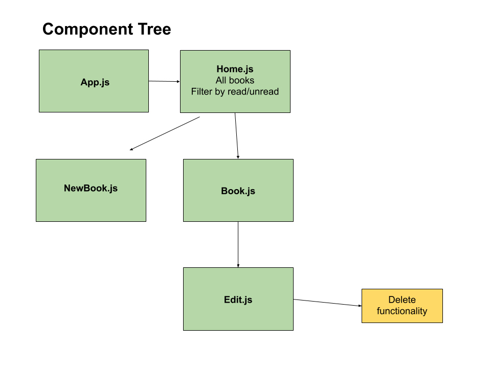
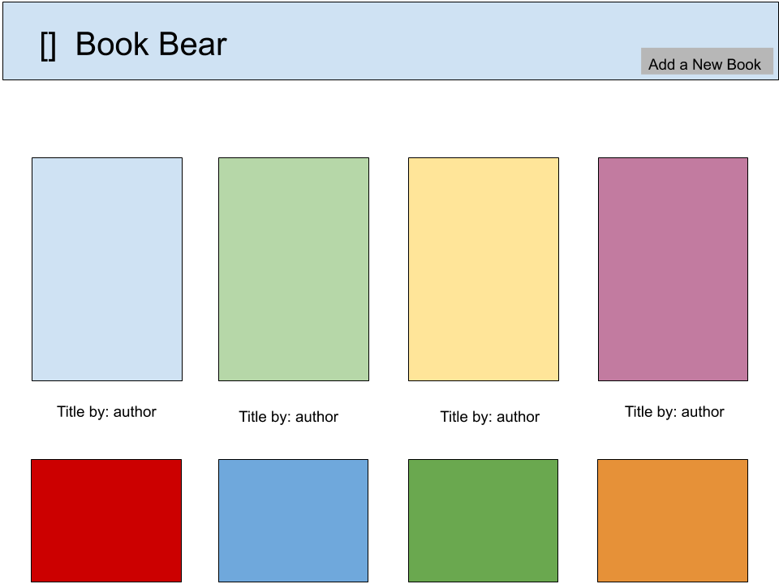
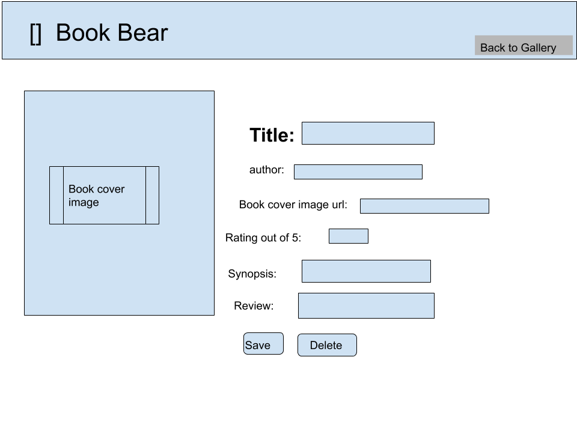
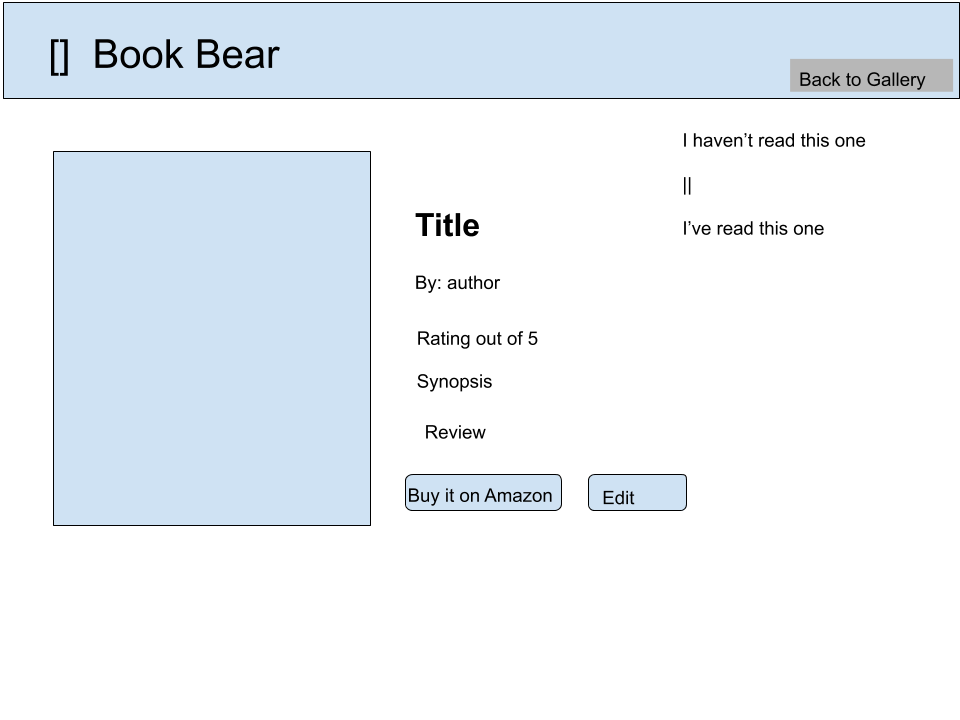

# Book Bear

made by Joe, Asha, Dan(scrum master!), and Teresa

## about Book Bear

Book Bear is a reading list management application. Users can add, edit, and remove books from their digital book shelf.

This app solves the problem of remembering books of interest and also provides a place to reflect on books you've read and leave reviews.

## book model

```javascript
{
title: {
    type: String,
    required: true
},
author: {
    type: String,
    default: "Click edit to add an author"
},
coverPhotoURL: {
    type: String,
    default: "put default url here"
},
amazonURL: {
    type: String,
    default: "http://amazon.com"
},
readStatus: {
    type: Boolean,
    default: false
},
synopsis: {
    type: String,
    default: "Click edit to add a synopsis"
},
review: {
    type: String,
    default: "Click edit to add a review"
},
rating: {
    type: Number,
    min: 0,
    max: 5
}
}
```


## wireframes


Component Tree

Landing page

New view

Show view

edit view


## user stories

C - as a user, I want to be able to add books to my shelf
R - as a user, I want to be able to see all the books or a specific that I've added
U - as a user, I want to know which books I've read and leave reviews for them
D - as a user, I want to be able to remove books I no longer want to display/read/remember


## MVP
- [ ] Full-stack MERN app
- [ ] Full CRUD capability
- [ ] Be deployed on Heroku/Atlas
- [ ] Employ mocha/chai/supertest for backend routes
- [ ] Our API will have RESTful routes
- [ ] Mobile, tablet, and desktop responsive
- [ ] Thorough documentation
- [ ] Beautifully designed with CSS

## stretch goals 
- [ ] User model with login feature
- [ ] Search feature
- [ ] Star rating
- [ ] User model include saved books
- [ ] Book model includes users that have saved the book
- [ ] Users can filter books by read/unread status
- [ ] Change views between list/gallery
